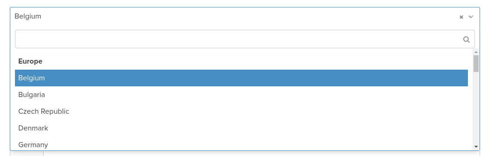
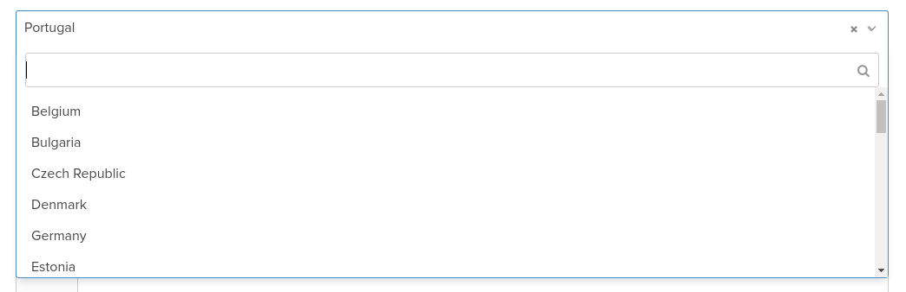

# sf-continent-country-type

A Symfony bundle that provides a new form-type called "ContinentCountryType".  It's like Symfony's `CountryType` but allows developers to group countries by continent.  The list of countries and continents that are displayed can be easily customised.

## Screenshots

(Select2 has been used to render the dropdown lists in the following examples.)

Example of a dropdown with countries grouped by continent:


Example of a 'simple' country dropdown:


## Installation

* Run `composer require powderblue/sf-continent-country-type`
* Update your project `app/AppKernel.php` file and add the bundle to the `$bundles` array:

```php
$bundles = [
    // ...
    new PowderBlue\SfContinentCountryTypeBundle\PowderBlueSfContinentCountryTypeBundle(),
];
```

## Usage

In the `buildForm` method of a form-type class, specify `ContinentCountryType::class` as the type.

```php
use PowderBlue\SfContinentCountryTypeBundle\Form\Type\ContinentCountryType;

// ...

$builder
    // ...
    ->add('country', ContinentCountryType::class, [
        'label' => 'Country',
        'attr' => [
            'placeholder' => 'Country',
        ],
    ])
;
```

## Configuration

Below you can find a reference of all configuration options with their default values:

```yml
# config.yml

powder_blue_sf_continent_country_type:
    # The path of the file containing the countries (and continents) that should appear in the dropdown
    file: "%bundle_root_dir%/Resources/data/continent_country.csv"

    # Group the countries by continent in the dropdown?
    group_by_continent: true

    # The ID of the service used to parse the countries file.  It should implement `...\Provider\ContinentCountryProviderInterface`.
    provider: powder_blue_sf_continent_country_type.provider.continent_country_csv_file
```
