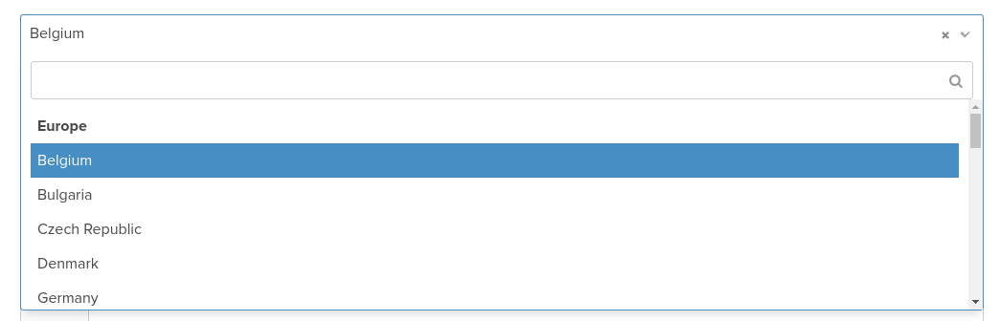

# sf-continent-country-type

## Introduction

This is a Symfony2 bundle that provides a new form-type called "ContinentCountryType".  This type is like Symfony's `CountryType` but allows developers to group countries by continent.  The list of countries and continents that are displayed can be easily customised.

## Screenshots

Example of a dropdown with countries grouped by continent:


Example of a simple country dropdown:


*Note: the *Select2* *jQuery* plugin has been applied to the above lists.*

## Installation

* Run `composer require powderblue/sf-continent-country-type`
* Update your project `app/AppKernel.php` file and add the bundle to the `$bundles` array:
```php
$bundles = [
    // ...
    new PowderBlue\SfContinentCountryTypeBundle\PowderBlueSfContinentCountryTypeBundle(),
];
```

## How to use

In the `buildForm` method of a form-type class, specify `ContinentCountryType::class` as the type. Don't forget to include the form type class:
```php
use PowderBlue\SfContinentCountryTypeBundle\Form\Type\ContinentCountryType;
```

Here is an example:
```php
$builder
    // ...
    ->add('country', ContinentCountryType::class, [
        'label' => 'Country',
        'attr' => [
            'placeholder' => 'Country',
        ],
    ])
;
```

## Configuration

Below you can find a reference of all configuration options with their default values:
```yml
# config.yml
powder_blue_sf_continent_country_type:
    file: %bundle_root_dir%/Resources/data/continent_country.csv
    group_by_continent: true
    provider: powder_blue_sf_continent_country_type.provider.continent_country_csv_file
```

### Options

- `file` - specifies the path of the file that contains countries (and continents) that should appear in the dropdown
- `group_by_continent` - specifies whether the countries should be grouped by continent in the dropdown
- `provider` - represents the ID of the service that is used to parse the countries file; it should implement the `PowderBlue\SfContinentCountryTypeBundle\Provider\ContinentCountryProviderInterface` interface
